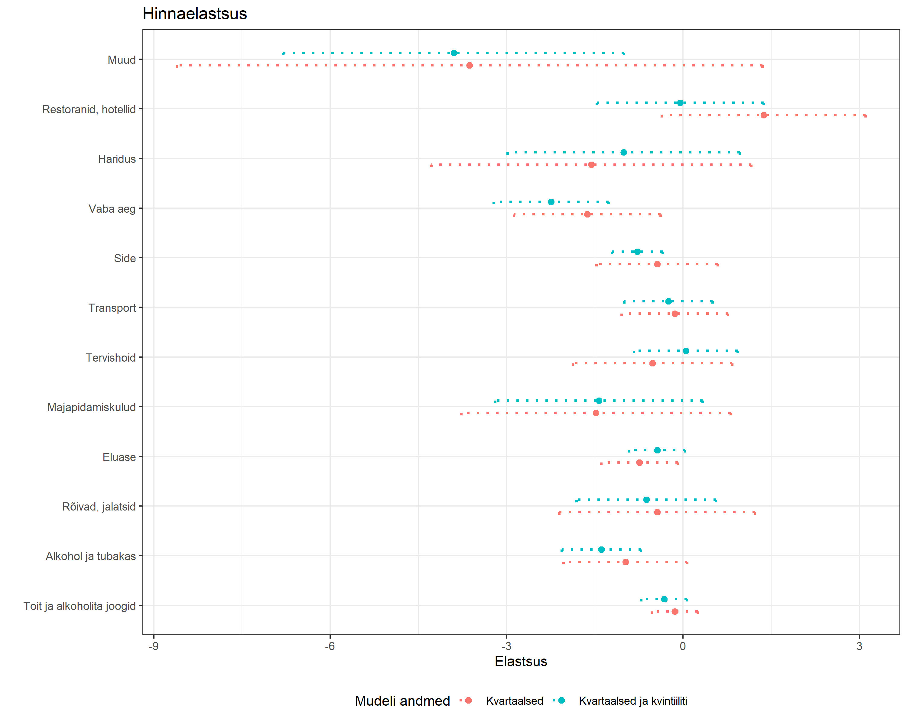

```{r setup, include=FALSE}
knitr::opts_chunk$set(echo = FALSE)

require(tidyverse)
require(plotly)

```

## Struktuur

- Hindamise vajadus
- Elastsuste hindamise meetodid
- Andmed ja metoodika
- Tulemused, https://andresvork.github.io/Raport_EE_LEUmikro.html
- Sisend projekti teistesse osadesse


## Meeldetuletuseks

- Eelmine versioon
    - ESA agregeeritud aastased andmed 1996-2007 kuludetsiilide ja 2010-2019 kulukvintiilide kohta
    - 13 kaubagruppi
    - Eurostati HICP komponentide hinnaindeksid
- Tulemused
    - https://andresvork.github.io/tarbimiselastsused.html
    - Kogukulutuste elatsused positiivse märgiga, mõistlikud
    - Hinnaelastsused - väga suurte usalduspiiridega
    - Liiga väike hindade varieeruvus (vaid aastane variatsioon)
- Idee
    - Kasutada kvartaalset sesoonsust
    - LEU mikroandmete põhjal ise agregeerida andmed kokku
    - Lootus saada täpsemad tulemused

## Andmed ja metoodika

- Andmed
    - LEU 2000-2007, 2010-2012, 2015-2016 ja 2019-2020
    - Kvartaalne kulutuste struktuur koos ja tarbimiskvintiilide kaupa
    - 12 kaubagruppi
    - Eurostati HICP komponentide hinnaindeksid kvartaalselt
- Metoodika
    - osaline analüüs (tarbimine ja kulutuste taseme), kogukulutuste elastsus
    - AIDS mudel, kompenseerimata hinnaelastsused ja tarbimise elastsus 
- Võrdlus varasemate teiste riikide tulemustega
    - Riikidevaheline paneelandmete põhine analüüs (Copenhagen Economics (2008), Kratena et al (2017) FIDELIO 2)
    - Riikide mikroandmete analüüsid
- Ettepanekud elatsusteks I-O mudelis


----

\Large\centerline{Tulemused - kirjeldav statistika}

----


Tarbimiskulud kvintiilide lõikes

{width=500px}

----

Tarbimiskulude osakaalud tarbimiskuludest tarbimiskvintiilide lõikes

{width=450px}

----

Kasutatavate hinnaindeksite kvartaalne dünaamika.

{width=400px}


----

Kvintiilide elukalliduse muutus (nn Stone'i hinnaindeks).

{width=400px}


## Osakaal sissetulekute ja kvintiilide lõikes

{width=600px}

## Kogukulutuste elastsused sissetulekuga võrranditest

Grupp| Ühine mudel|  Fikseeritud efektiga mudel|
|:-------------|:--------------|:--------------|
| Toit ja alkoholita joogid| 0.536| 0.544| 
| Alkoholjoogid ja tubakas| 0.792| 0.775| 
| Rõivad ja jalatsid| 1.33| 0.645| 
| Eluase| 0.699| 1.04| 
| Majapidamiskulud| 1.58|1.62|  
| Tervishoid|1.15 | 1.61| 
| Transport| 1.86 | 1.62 | 
| Side| 0.614 | 0.819| 
| Vaba aeg| 1.48| 1.65 | 
| Haridus| 1.93| 1.01 | 
| Restoranid ja hotellid| 1.79| 1.40 | 
| Mitmesugused kaubad ja teenused| 1.28 | 0.729|  


## Kogukulutuste elastsused LA/AIDS mudelist

Grupp| Stone| LaspeyresS | AIDS | Stone_kvint | AIDS_kvint 
|:-------------|:--------------|:-------------|:--------------|:--------------|:--------------|
| Toit ja alkoholita joogid| 0.49 | 0.49| 0.51| 0.46| 0.48| 
| Alkohol ja tubakas| 0.46| 0.47| 0.53| 0.77| 0.77|
| Rõivad ja jalatsid| 1.68| 1.73| 1.86| 1.45| 1.44|
| Eluase| 0.73| 0.66| 0.62| 0.62| 0.63|
| Majapidamiskulud| 1.06|1.12| 1.25|  1.55| 1.54|
| Tervishoid|1.44 | 1.40| 1.30| 1.08| 1.07|
| Transport| 1.65 | 1.67| 1.64 | 1.82| 1.79|
| Side| 1.01 | 1.03| 1.04| 0.55| 0.57|
| Vaba aeg| 1.36| 1.33| 1.28 | 1.42| 1.42|
| Haridus| 1.36| 1.56| 1.35 | 1.96| 1.94|
| Restoranid ja hotellid| 1.17| 1.07| 0.88 | 1.76| 1.74|
| Mitmesugused kaubad ja teenused| 1.12 | 1.17| 1.27|  1.36| 1.35|


----

{width=600px}


## Tabel. Omahinnaelastsused LA/AIDS mudelist

Grupp| Stone| LaspeyresS | AIDS | Stone_kvint | AIDS_kvint 
|:-------------|:--------------|:-------------|:--------------|:--------------|:--------------|
| Toit ja alkoholita joogid| -0.13 | -0.12| -0.12| -0.26| -0.26| 
| Alkohol ja tubakas| -0.98| -0.98| -0.99| -1.41| -1.41|
| Rõivad ja jalatsid| -0.40| -0.45| -0.43| -0.63| -0.63|
| Eluase| -0.80| -0.74| -0.78| -0.43| -0.42|
| Majapidamiskulud| -1.47|-1.50| -1.47|  -1.39| -1.40|
| Tervishoid|-0.57 | -0.54| -0.62| 0.02| 0.02|
| Transport| -0.17 |-0.15| -0.15 | -0.33| -0.34|
| Side| -0.39 | -0.45| -0.42| -0.78| -0.77|
| Vaba aeg| -1.73| -1.61| -1.68 | -2.15 | -2.14|
| Haridus| -1.57| -1.55| -1.47 | -1.07| -1.01|
| Restoranid ja hotellid| 1.10| 1.38| 1.19 | -0.14| -0.17|
| Mitmesugused kaubad ja teenused| -3.80 | -3.53| -3.73|  -3.35| -3.32|

----

{width=600px}

## Teised uuringud

  - Võrk, Selliov (2002) toidu- ja mittealkohoolsete jookide kogukulutuste elastsus 0.3-0.4 ja otsene hinnaelastsus ca -0.5. Meil 0.5 ja-0.1 kuni -0.3.
  - 
  
---- 

{width=500px}

Allikas: @kratena_fidelio_2017, lk 34

----
{width=500px}
----

{width=500px}

## Poola tarbimise elastsused QUAIDS mudelist

Goods| Price elasticities| Expenditure elasticities |
|:-------------|:--------------|:-------------|
|Home and equipment including   expenditure for housing, water, electricity, gas and furnishings, household   equipment | –0.824 | 0.878 | 
Communication and education | –1.266 |  0.669 |
|Miscellaneous goods and   services including expenditure for alcoholic beverages, tobacco, expenditure   for clothing and footwear and miscellaneous goods and services | 0.755 | 1.292 |
|Transport and recreation | –1.315  | 1.697 | 
|Food and health | –0.359 | 0.717 |
|Restaurants and hotels | –2.650 | 1.517 |

Allikas: @gostkowski_elasticity_2018, tabelid 4 ja 5


## Türgi tarbimise elastsused LES mudelist

Goods| Price elasticities| Expenditure elasticities |
|:-------------|:--------------|:-------------|
|Food |	-0.884 |	0.935
|Clothing |	-1.113 |	1.356
|Furniture |	-1.211 |	0.978
|Health	|-1.165	| 1
|Housing	|-0.982	| 0.991
|Transport and communication | -1.191	| 0.795
|Culture, Education, Recreation	| -1.28	| 1.027
|Miscellaneous  | -1.373	| 1.141

Allikas: @ozer_demand_2003, tabelid 4 ja 5

## Uuringute elastsused võrrelduna

```{r echo=FALSE}
library(readxl)
elastsusedmeta <- read_xlsx(path  = "../Raport/elastsusedmeta.xlsx", sheet ="Sheet1")
#head(elastsusedmeta)
#summary(elastsusedmeta)

#laiale kujule elastsused
dfel <- elastsusedmeta %>% spread(key = "Elastsus", value = "Vaartus")

p1 <- ggplot(dfel, aes(x=Hinnaelastsus, y = Kogukuluelastsus, color = Grupp, shape = Allikas)) +
  geom_point()

ggplotly(p1)

```

## IO tabelisse

```{r echo=FALSE}
library(readxl)
dfcoicopio <- read_xlsx(path  = "../Muu/Tegevusala tootegrupp coicop.xlsx", sheet ="andmed")
#dfcoicopio <- read_xlsx(path  = "./Muu/Tegevusala tootegrupp coicop.xlsx", sheet ="andmed") 

dfcoicopio <- dfcoicopio %>% 
  select(Rida, Tegevusala, `EMTAK 2008`, `Kodumajapidamiste osakaal kogutoodangus`, COICOPtase1, COICOPtase1nimetus, Sissetulekuelastsus,	Hinnaelastsus)

colnames(dfcoicopio)<- c("Rida", "Tegevusala", "EMTAK", "Kodumajapidamisteosakaal","COICOP", "Nimetus", "Sissetulekuelastsus", "Hinnaelastsus")

dfcoicopio$Kodumajapidamisteosakaal <- pmin(round(dfcoicopio$Kodumajapidamisteosakaal, 3),1)

p2 <- dfcoicopio  %>% 
  filter(EMTAK!= "97-98") %>% 
    ggplot(aes(x=Sissetulekuelastsus, y = Hinnaelastsus, 
                             size = Kodumajapidamisteosakaal,
                             text = Tegevusala)) +
         geom_jitter(width = 0.1, height = 0.1)

require(plotly)
ggplotly(p2)

```


## Kasutatud materjalid

<div id="refs"></div> 


----

\Large\centerline{Suur tänu!}

\centerline{Andres Võrk, andres.vork@ut.ee}

----

\Large\centerline{Lisa}
