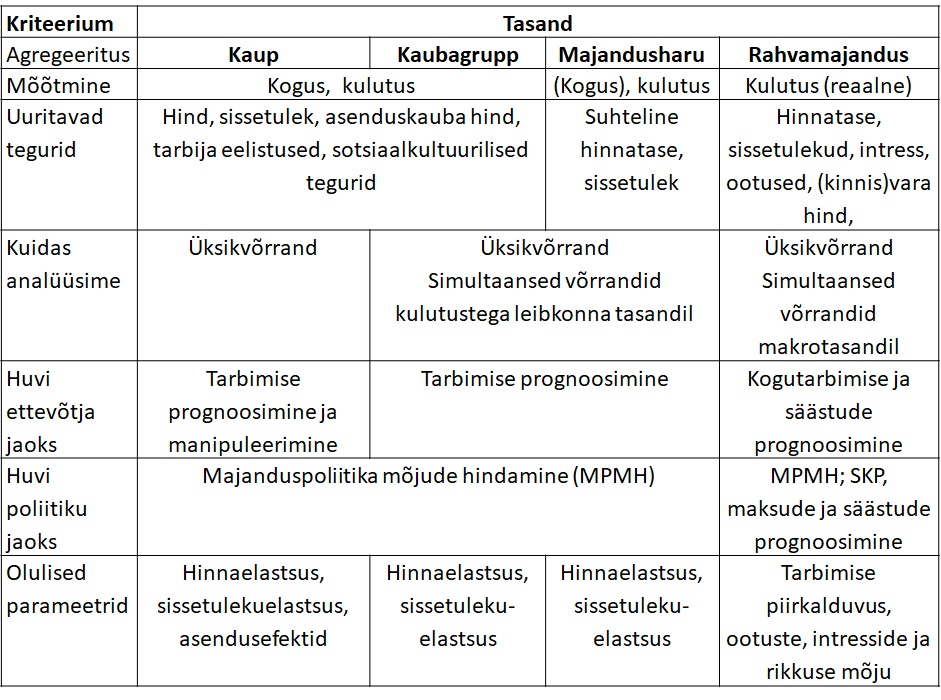
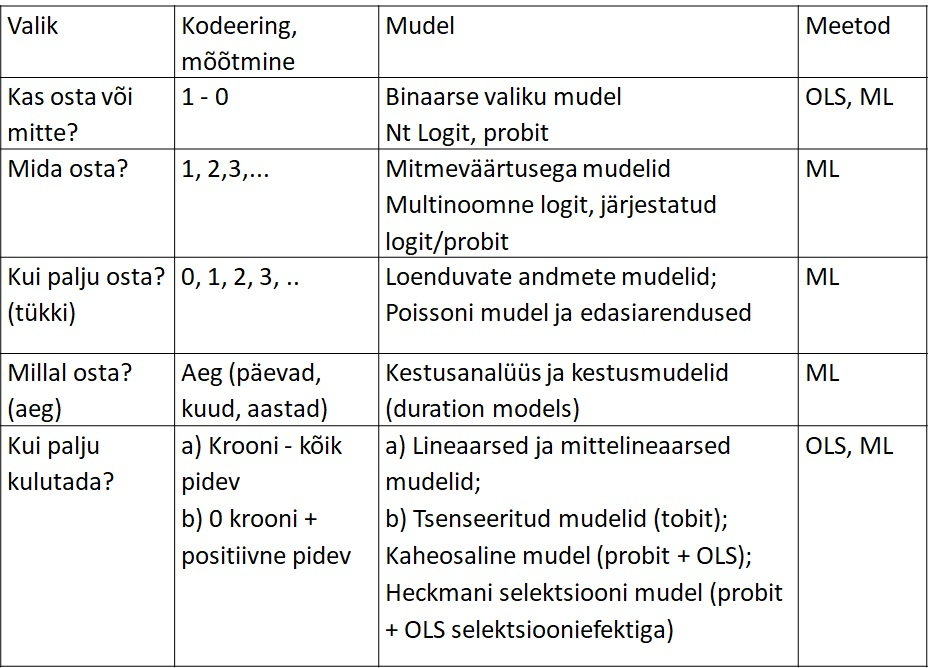
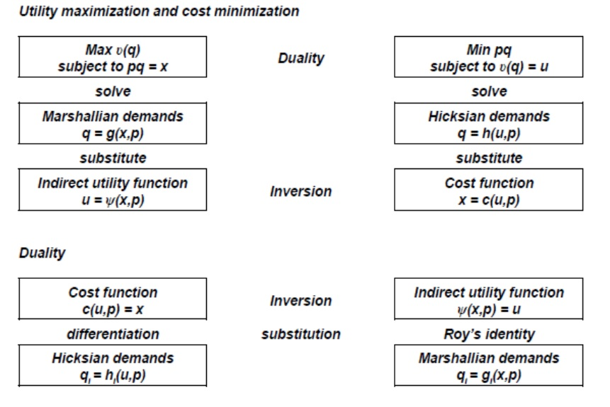

<style type="text/css">

body{ /* Normal  */
      font-size: 14px;
  }
td {  /* Table  */
  font-size: 12px;
}
h1.title {
  font-size: 24px;
  color: DarkRed;
}
h1 { /* Header 1 */
  font-size: 20px;
  color: DarkBlue;
}
h2 { /* Header 2 */
    font-size: 18px;
  color: DarkBlue;
}
h3 { /* Header 3 */
  font-size: 16px;
  font-family: "Times New Roman", Times, serif;
  color: DarkBlue;
}
code.r{ /* Code block */
    font-size: 12px;
}
pre { /* Code block - determines code spacing between lines */
    font-size: 14px;
}
</style>


```{r setup, include=FALSE}
knitr::opts_chunk$set(
	echo = TRUE,
	message = FALSE,
	warning = FALSE
)
library(tidyverse)
library(plotly)

# setwd("C:/Users/avork/Documents/demandsystemEE")
 
```

## Sissejuhatus

Käesolev analüüs hindab Eesti majapidamiste tarbimise hinna- ja kogukulutuste elastused. Analüüs on sisendiks projekti "Projekti C-19 majandus ehk COVID-19 seotud majandusmõjude ning nende pehmendamiseks mõeldud poliitikameetmete tõhususe hindamine" raames (https://c19majandus.ut.ee/) loodud simulatsioonimudelile. Analüüsis kasutatakse leibkonna-eelarve uuringu andmeid kulutuste struktuuri kohta ja tarbijahinnaindeksi komponente kaubagruppide hindade kohta. Elastsuste leidmiseks kasutatakse AIDS nõudlussüsteemi  (_almost ideal demand system_) hindamisel saadud parameetreid. Analüüs annab esmalt lühiülevaate nõudluse modelleerimise mikroökonoomilistest alustest. Seejärel kirjeldatakse kasutatavaid andmeid,  analüüsimeetodeid ja tulemusi ning võrreldakse neid teiste uuringute tulemusena. Käesoleva analüüsi tulemusena ja tuginetakse varasematele uuringutele pakutakse välja sissetuleku-  ja hinnaelastsused, mida kasutada sisend-väljundtabeli põhises Eesti mudeli. 

<!-- Andmeanalüüsi aluseks olevad Ri koodid on kättesaadavad githubis https://github.com/AndresVork/demandsystemEE. -->

## Lühike nõudluse modelleerimise mikroökonoomiline taust

Nõudluse kvantitatiivse analüüsi viis ja meetod sõltub sellest, mis tasemel analüüsitakse (toode, kaubagrupp, majandusharu või kogumajandus). Enamasti uuritakse hinna, leibkondade sissetuleku ja muude sotsiaaldemograafilsite tegurite mõju tarbimisele. Tulemusi väljendatakse numbriliselt sagedasti elastsustena.

{width=500px}

Empiirilise uuringute puhul on väljakutseks leida kooskõla mikroökonoomika teooria eeldustega tarbijakäitumise kohta (nn majapidamisteooria), mis seab nõudlusfunktsioonidele teatud piirangud.  

Majapidamisteooria järgi võib lihtsustatult vaadata tarbimisotsuste tegemist kahesammulisena. Esimeses sammus otsustatakse kui palju töötada ja tarbida ning teise sammuna, kuidas tarbimiskulutusi jagada.

1.samm: tarbimiskulude suuruse määramine

  - Tarbija maksimeerib heaolu  $𝑈=𝑈(𝐿,𝐶)$
  - Arvestades ajapiirangut     $𝐿_0=𝐿+ℎ$
  - Ja eelarvepiirangut         $𝑝𝐶=𝑤ℎ+𝑅$
  - Leiame optimaalse töötunnid $ℎ=𝐹(𝑤,𝑝,𝑅)$ 
  ja tarbimiskulutused $ℎ=𝐹(𝑤,𝑝,𝑅)$

Eelarvepiirang võib olla ka mittelineaarne töötundide suhtes (nt mittelineaarse maksusüsteemi või toetuste korral). Dünaamilistes mudelites lisandub ka säästmine, millega silutakse tarbimist.

Kui tarbimise kogukulud teada, siis teise sammuna määratakse tarbimise struktuur: 

  - Tarbija maksimeerib heaolu sõltuvana erinevate kaupade tarbimisest $𝑈=𝑈(𝑞_1,𝑞_2,...,𝑞_𝑘)$
  
  - Arvestades eelarvepiirangut $𝑝_1 𝑞_1×𝑝_2 𝑞_2×...𝑝_𝑘 𝑞_𝑘=𝑦$, kus _y_ on kogutarbimine või kogu sissetulek sõltuvana sellest, kas arvestame ka säästmist või mitte.
      
Maksimeerimisülesande lahendamisel saame nõudlusfunktsioonid, kus tarbitav kogus sõltub hindadest ja sissetulekust.
  
$$
\begin{aligned}
𝑞_1=𝑓_1 (𝑝_1,𝑝_2...𝑝_𝑘,𝑦)  \\
𝑞_2=𝑓_2 (𝑝_1,𝑝_2...𝑝_𝑘,𝑦)  \\ 
...                               \\
𝑞_𝑘=𝑓_𝑘 (𝑝_1,𝑝_2...𝑝_𝑘,𝑦)
\end{aligned}
$$

Sageli defineeritakse i-nda kauba kulutuste osakaal kogukulutustes $𝑤_𝑖=𝑝_𝑖q_𝑖/𝑦$ ja seejärel võib hinnata seosed kas koguse, kulutuste või osakaaluna:

$$
\begin{aligned}
\text{kogus   } & 𝑞_𝑖=𝑓_𝑖 (𝑝_1,𝑝_2...𝑝_𝑘,𝑦)+𝑢_𝑖 \\
\text{kulutus   } & 𝑝_𝑖 𝑞_𝑖=𝑓_𝑖 (𝑝_1,𝑝_2...𝑝_𝑘,𝑦)+𝑢_𝑖 \\
\text{osakaal   } &𝑤_𝑖=𝑓_𝑖 (𝑝_1,𝑝_2...𝑝_𝑘,𝑦)+𝑢_𝑖
\end{aligned}
$$

Praktikas kulutusi agregeeritakse erinevatesse gruppidesse. Sõltuvalt analüüsi eesmärgist eristatakse kestuskaupa ostmist (nt autod, kallim kodutehnika) ja muid kaubagruppe.

Mikroökonoomika majapidamisteooria eelduste kohaselt on omavahel seotud kasulikkuse maksimeerimine või kulude minimeerimine, Hicksi nõudlusfunktsioonid ja Marshalli nõudlusfunktsioonid, kulufunktsioon ja kaudne kasulikkusfunktsioon. Sellest tulenevalt saab püstitada ja hinnata nõudluse võrrandeid ning tervikuid nõudlussüsteeme erineval kujul ning tuletada vajalikud seosed hinnatud parameetritest.


### Mõjuhinnangud ja elastsused

Analüütikutena ollakse huvitatud nii nõudluse absoluutsetest muutustest hindade ja sissetuleku muutudes kui ka suhtelistest muutustest ehk elastsustest. Mikroandmete põhjal hinnatud seosekordajaid ja elastsusi saab omakorda kasutada makromudelites.

  - Oma hinna muutuse mõju: $𝜕𝑞_𝑖/𝜕𝑝_𝑖$
  - Teise kauba hinna muutuse mõju: $𝜕𝑞_𝑖/𝜕𝑝_𝑗$
  - Sissetuleku (või kogukulutuste) muutuse  mõju: $𝜕𝑞_𝑖/𝜕𝑦$
  - Omahinnaelastus: 

  $$𝑒_{ii}=(𝜕𝑞_𝑖/𝑞_𝑖)/(𝜕𝑝_𝑖/𝑝_𝑖)=𝜕ln𝑞_𝑖/𝜕ln𝑝_𝑖$$
  
  - Hinna ristelastus: 
  
  $$𝑒_{ij}=(𝜕𝑞_𝑖/𝑞_𝑖)/(𝜕𝑝_j/𝑝_j)=𝜕ln𝑞_𝑖/𝜕ln𝑝_j$$
    
  - Sissetulekuelastsus või kogukulutuste elastsus:
  
  $$𝑒_{i}=(𝜕𝑞_𝑖/𝑞_𝑖)/(𝜕y/y)=𝜕ln𝑞_𝑖/𝜕lny$$
  

### Nõudlusfunktsioonid

Nõudlusfunktsioonide puhul eristatakse Hicksi ja Marshalli nõudlusfunktsioone. *Hicksi nõudlus* (ehk kompenseeritud nõudlus) näitab, kuidas muutub nõutav kaubakogus, kui muutub hind, teiste hindade ja kasulikkusetaseme samaks jäädes: 

$ℎ_𝑖=ℎ(𝑝_1,𝑝_2,...,𝑝_𝑘,𝑈^∗)$

Selleks, et nõudlus saaks muutuda, peavad siis muutuma kulutused (sissetulekute vähenemine kompenseeritakse).


*Marshalli nõudlus* (ehk kompenseerimata nõudlus) näitab, kuidas muutub nõutav kaubakogus, kui muutub hind, teiste hindade ja kogukulutuste samaks jäädes:

$𝑞_𝑖=𝑞(𝑝_1,𝑝_2,...,𝑝_𝑘,𝑦)$

Nõudlus muutudes peab seega muutuma kasulikkus. Makromudelites kasutatakse enamasti kompenseerimata nõudlust.


*Slutsky võrrand* seob omavahel Hicksi ja Marshalli nõudlused.

$$𝜕𝑞_𝑖/𝜕𝑝_𝑗=𝜕ℎ_𝑖/𝜕𝑝_𝑗−𝜕𝑞_𝑖/𝜕𝑦×𝑞_𝑗$$
Slutsky võrrand näitab, et koguse muutus tulenevalt hinna muutusest (Marshalli nõudlus) sõltub asendusefektist ja sissetulekuefektist. Asendusefekt näitab, mis juhtub kogusega, kui muutuvad suhtelised hinnad, aga kasulikkus jääb samaks. Sissetulekuefekt näitab, kuidas muutub kogus, kui muutub sissetulek.

Elastsuste kujul Slutsky võrrand: 

$𝑒_{𝑖𝑗}=𝑒_{𝑖𝑗}^∗ −𝑒_𝑖×𝑤_𝑗$

Marshalli elastsus = Hicksi elastsus - sissetulekuelastsus korda kaubagrupi osakaal tarbimiskuludes.

Slutsky võrrandid kasutatakse selleks, et leida vajadusel puuduv elastsuse näitaja.

### Ühevõrrandilised ökonomeetrilised mudelid

Ühevõrrandilised ökonomeetrilised mudelid on sobivad kitsama tootegrupi ostude analüüsimiseks, nt alkoholitoodete tarbimise sõltuvus sissetulekutest ja hindadest. Ühevõrrandilised mudelite sõltuv tunnus võib olla kas diskreetne tunnus (nt binaarne, loenduv) või pidev tunnus (kui palju kulutada).

{width=500px}

### Pidevad ühevõrrandilised mudelid

Pidevad ühevõrrandilised mudelid võivad olla kas lineaarsel kujul või logaritmkujul (enamasti).

Lineaarne mudel:
$$q_i= \alpha + \gamma_i y + \sum_{j=1}^k \beta_{ij}p_j + u_i$$

Või logaritmkujul:

$$log(q_i)= \alpha + e_i log(y) + \sum_{j=1}^k e_{ij}log(p_j) + u_i$$


Reaalsissetuleku arvutamisel leitakse sageli hinnaindeks üksikute hindade geomeetrilise keskmisena. Hinnatud seoseparameetrid annavad kohe elastsused reaalse sissetuleku ja hindade suhtes.


$$
\begin{aligned}
log(q_i) & = \alpha + e_i log(y/P) + \sum_{j=1}^k e_{ij}log(p_j) + u_i \\
logP & = \sum_{j=1}^k w_j log(p_j)
\end{aligned}
$$

Üks enam-levinud funktsionaalseid kujusid on **Workingi-Leser’i mudel** [@working_statistical_1943; @leser_forms_1963], kus hinnatakse kulutuste osakaalu sõltuvust sissetulekust, hindadest ja võimalusel muudest leibkondi iseloomustavatest teguritest (_H_).

$$w_i= \alpha_0 + \alpha_i log(y) + \sum_{j=1}^k \beta_{ij}log(p_j) + \lambda H_i + u_i$$
kus $w_i= q_i p_i / y$

Workingi-Leseri mudeli kuju on omakorda aluseks AIDS mudelile, kus hinnatakse ülaltoodud seosed kõikide kaubagruppide jaoks simultaanselt.

Elastsused avalduvad Workingi-Leseri mudelist järgmiselt:

Kompenseerimata (Marshalli) omahinnaelastsus: $𝑒_{ii} =−1+𝛽_{ii}/𝑤_𝑖$

Risthinnaelastus: $𝑒_{ij}=𝛽_{ij}/𝑤_𝑖$

Sissetulekuelastsus: $𝑒_𝑖=1+𝛼_𝑖/𝑤_𝑖$

Kui mudelis on mitte sissetulek $y$ vaid kogukulud $x$, siis võib eraldi hinnata seose, kus kogukulud $x$ sõltuvad sissetulekust $y$. Enamasti ongi tarbimismudelis sissetuleku asemel tarbimise kogukulutused. 

Mikroandmete puhul võib hinnata veel ka Working-Leser’i mudel koos tsenseerimisega (Tobit mudel) või koos selektsiooniga (Heckmani mudel).


<!-- $$ -->
<!-- 𝑤_𝑖^∗=𝛼_0+𝛼_𝑖  log⁡( 𝑦)+∑_(𝑗=1)^𝑘▒〖𝛽_𝑖𝑗  log⁡( 𝑝_𝑗)〗+𝜆𝐻_𝑖+𝑢_𝑖 -->
<!-- 𝑤_𝑖^∗={■(𝑤_𝑖 "kui"  𝑤_𝑖^∗>0@0 "  kui"  𝑤_𝑖^∗≤0)┤ "ja" 𝑢_𝑖  ~⁡𝑁 (0,𝜎^2) -->
<!-- $$ -->

<!-- $$ -->
<!-- 𝑤_𝑖^∗=𝛼_0+𝛼_𝑖  log⁡( 𝑦)+∑_(𝑗=1)^𝑘▒〖𝛽_𝑖𝑗  log⁡( 𝑝_𝑗)〗+𝜆𝐻_𝑖+𝑢_𝑖𝐼_𝑖^∗=𝛼_0+𝛼_𝑖  log⁡( 𝑦)+∑_(𝑗=1)^𝑘▒〖𝛽_𝑖𝑗  log⁡( 𝑝_𝑗)〗+𝜆〖𝐻^′〗_𝑖+𝑣_𝑖𝑤_𝑖^∗={■(𝑤_𝑖 "kui"  𝐼_𝑖^∗>0@"pole jälgitav"  "  kui"  𝐼_𝑖^∗≤0)┤ "ja" (■(𝑢_𝑖@𝑣_𝑖 ))  ~⁡𝑁 𝐼𝐷((■(0@0)), (■(𝜎_1^2&𝜎_12@𝜎_12&1))) -->

<!-- $$ -->


### Tarbimisevõrrandite süsteemid

Kui tegemist on tarbija eelarve jaoks oluliste kaubagruppidega, siis peab arvestama, et leibkonnad teevad kulutused simultaanselt ja ei saa iga tootegrupi võrrandid käsitleda eraldiseisvalt vaid peab hindama nõudlusvõrrandid korraga.

<!-- - „Mõnevõrrandilised mudelid“, Nt kaks kauba võrrandit, mis seotud -->

Nõudlussüsteemi hidamisel on palju erinevaid lähenemisi. Nõudlussüsteemi puhul arvestatakse, et kaubagruppidele tehtud kulutuste kogusumma peab võrduma tarbimiskulude kogusummaga. Teaduskirjanduses on välja pakutud palju erinevaid nõudlussüsteeme: 

- The Linear Expenditure System
- The Extended Linear Expenditure Model
- The Rotterdam Model
- The Quadratic Expenditure System
- The Indirect Translog Model
- AIDS - The Almost Ideal Demand System
- Quadratic AIDS (QUAIDS)
- Linear Approximation AIDS (LA-AIDS)
- PADS – Perhaps Adequate Demand System
- Censored Demand Systems
- Dynamic Demand Systems
- ...

Esimene, kes tuletas tarbijateooriast nõudlusvõrrandite süsteemi (ehk nõudlussüsteemi) ja hindas selle oli Stone (1954). Populaarseks hindamismudeliks kujunenud AIDSi võtsid esimesena kasutusele Deaton ja Muellbauer (1980). Nõudlussüsteeme on empiiriliselt hinnatud paljude riikide kohta. 

<!-- Näiteks on hinnatud süsteemid Ungari, Poola ja Tšehhi jaoks (Banse ja Brosig, 1998). Mitmeastmelist eelarvestamist on kasutatud ja seega ka üksikute toiduainete gruppide jaoks nõudluse hinna- ja sissetulekuelastsused on leitud näiteks Tšehhi (Brosig, 1998) ja Sloveenia, Bulgaaria ning Rumeenia puhul (Mergos ja Mizzi, 1999). Elanikkonda sissetulekute järgi kolmeks grupiks jagades on leitud toiduainete nõudluselastsused USA jaoks (Huang ja Lin, 2000). -->


## Analüüsimetoodika

### Almost Ideal Demand System (AIDS)

Empiirilises analüüsis kasutatakse AIDS mudelit. Alljärgnevalt antakse lühiülevaade mudeli struktuurist tuginedes palju Henningseni ülevaatele @henningsen_demand_2017.

AIDS nõudlussüsteemil [@deaton_almost_1980] on mitmeid häid teoreetilisi omadusi: 
a) ta on esimest järku lähendus suvalisele nõudlussüsteemile,
b) ta rahuldab mikroökonoomikast tundud eeldusi tarbijakäitumise kohta,
c) seda on võimalik agregeerida üle üksikute inimeste säilitades siiski mittelineaarse Engeli kõvera,
d) homogeensuse omadust (tarbimine ei muutu, kui hinnad ja sissetulekud suurenevad kõik võrdselt) ja sümmeetria omadusi (ristelastsused on võrdsed) saab testida
e) nõudlussüsteem muutub lineaarseks, kui translog kujul olevat hinnaindeksid lähendada Stone'i hinnaindeksiga.


<!-- (+) Rahuldab teoreetilisi kitsendusi -->
<!-- (-) Hinnaindeks parameetrite suhtes mittelineaarne - keeruline hinnata ning Engeli kõverad mittelineaarsed. Selle tõttu võib mõni osakaal minna negatiivseks kui sissetulek kasvab. -->

AIDS mudel tugineb mikroökonoomikast tuntud majapidamisteooriale. Mudeli alguskohaks on kulutuste funktsioon (mis näitab, milline on minimaalne kulutus $m$, mida majapidamine peab tegema, et saavutada etteantud hindade $p$ korral vajalik kasulikkuse tase $U$).

$$\ln m_t = \ln e(p_t, U_t) = \alpha_0 + \sum_{i} \alpha_{i} \ln p_{it} + \frac{1}{2}\sum_{i}\sum_{ij} \gamma^*_{ij}\ln p_{it} \ln p_{jt} + U_t\beta_0\prod_i p^{\beta_i}_{it}$$
Kulutuste funktsioonist saab tuletada Shepardi lemma abil Marshalli nõudlusfunktsioonid asendades kasulikkusfunktsiooni kaudse kasulikkusfunktsiooniga.

$$x_{it}(p_t, m_t) = \frac{m_t}{p_{it}} (\alpha_i + \sum_{j} \gamma_{ij} \ln p_{jt} + \beta_i \ln(m_t/P_t))$$
kus $x_{it}$ on tarbitav kogus ja parameetrid $\gamma_{ij}$ on seotud esialgsete parameetritega $\gamma_{ij} = \frac{1}{2} (\gamma^*_{ij} + \gamma^*_{ji})$.

$P_t$ on translog hinnaindeks, mis teeb mudeli algselt mittelineaarseks.

$$\ln P_t= \alpha_0 + \sum_{i} \alpha_{i} \ln p_{it} + \frac{1}{2} \sum_{i}\sum_{j} \gamma_{ij} \ln p_{it} \ln p_{jt}$$
Marshalli nõudlusfunktsioone saab lihtsustada avaldades koguste asemel osakaalud.

$$s_{it}(p_t, m_t) = \frac{x_{it}p_{it}}{m_t}  = \alpha_i + \sum_{j} \gamma_{ij} \ln p_{jt} + \beta_i \ln(m_t/P_t)$$

Mikroökonoomika teooriast tulenevad kitsendused nõudlussüsteemile.
1) Osakaalude summa peab võrduma ühega. See on alati täidetud, kui parameetritele kehtivad järgmised kitsendused:

$$\sum_i\alpha_i =1; \space \sum_i\beta_i =0; \space \sum_{i} \gamma_{ij} =0 \space \forall \space j$$

2) ei tohi olla raha illusiooni (homogeensuse tingimus) - kui kõik hinnad ja sissetulekud suurenevad sama arv korda, siis nõudlus ei muutu.

$$\sum_{j} \gamma_{ij} =0 \space \forall \space i$$

3) Sümmeetria tingimus tuleb Shepardi lemmast. 

$$\gamma_{ij} = \gamma_{ji} \space \forall \space i, j$$

Empiiriliselt hindamegi seosed osakaalude kujul:

$$w_{it}= \alpha_i + \sum_{j} \gamma_{ij} \ln p_{jt} +  \beta_i \ln(m_t/P_t) + u_{it} $$

Parameetride hindamisel peab ühe võrrandi välja jätma, sest kuna vealiikmete summa on automaatselt null $\sum_i u_{it} =0 \space \forall \space t$, siis on vealiikmete kovariatsioonimaatriks singulaarne. Ühe võrrandi puuduvad parameetrite hinnangud tuletatakse siis ülaltoodud piirangutest parameetritele.

Marshalli nõudlusfunktsioonid ise on küll lineaarsed, kuid kuna hinnaindeks on mittelineaarne, siis on mudeli hindamine siiski keerukas. Peale mudeli parameetrite hindamist saab leida hinnangud elastsustele, kuid need on nüüd keerulisemate valemitega, sest hinna mõju avaldub lisaks läbi üldise hinnaindeksi.

<!-- Sissetulekuelastsus avaldub järgmiselt (sama, mis ülal Working-Leseri mudelis) -->

<!-- $$\varepsilon_i = 1+\beta_i / w_i $$ -->

<!-- Otsese Marshalli hinnaelastsuse lähendina saab kasutada järgmisi valemeid -->

<!-- $$\varepsilon_{ii}=(\gamma_{ii}-\beta_i \times w_i)/𝑤_i - 1$$ -->

<!-- ja risthinnaelastsus -->

<!-- $$\varepsilon_{ij}=(\gamma_{ij}-\beta_i \times w_j)/𝑤_i$$ -->


<!-- Elastused võib leida, kas keskmiste osakaalude juures või leida kõikide vaatluste jaoks ning siis leida keskmine üle elastsuste. -->


### Linear Approximate Almost Ideal Demand System 

Et translog hinnaindeksiga nõudlussüsteemi on keeruline hinnata, sest tegemist on väga mittelineaarse süsteemiga, siis kasutatakse sageli hinnaindeksi puhul lineaarset lähendit.

LA-AIDS = AIDS koos lineaarse hinnaindeksiga

$$w_{it}= \alpha_i^S + \sum_{j} \gamma^S_{ij} \ln p_{jt} +  \beta^S_i \ln(m_t/P^S) + u^S_{it} $$

kus $P^S$ on Stone’i hinnaindeks

$$lnP^S_t = \sum_{i} w_{it} \ln p_{it}$$ 

Et Stone'i hinnaindeks kasutab osakaale, siis on nii võrrandi paremal kui vasakul pool samad tunnused. Stone'i hinnaindeksi asemel võib kasutada ka teisi hinnaindekseid, nt Laspeyrese hinnaindeks, mis kasutab sama perioodi osakaalude asemel keskmisi osakaale, et vähendada võrrandite simultaansust.

$$lnP^L = \sum_i \bar w_{i} \ln p_i$$ 

Võib kasutada ka viitajaga kaaludega Stone'i hinnaindeksit:

$$lnP^{SL}_t = \sum_{i} w_{i, t-1} \log p_{it}$$ 

Esineb ka teisi lähendusi hinnaindeksitele. 


Kui mudeli parameetrid on hinnatud kas vähimruutude meetodil, üldistaud vähimruutude meetodil (SURE - seemingly unrelated regression equations) või iteratiivselt, siis saab hinnatud parameetritest avaldada elastsused. 

Otsese Marshalli hinnaelastsuse lähendina saab kasutada erinevaid valemeid. Nt Chalfant (1987) pakub järgmist lähendit:

$$\varepsilon_{ii}=(\gamma_{ii}-\beta_i \times w_i)/𝑤_i - 1$$

ja risthinnaelastsuse lähendina:

$$\varepsilon_{ij}=(\gamma_{ij}-\beta_i \times w_j)/𝑤_i$$

Esineb veel teisi võimalusi. 
<!-- (AIDS, Green + Alston, Goddard, Eales + Unnevehr). -->

Elastused võib leida, kas keskmiste osakaalude juures või leida kõikide vaatluste jaoks ning siis leida keskmine üle elastsuste.

<!-- _TODO:! Täpsustada elastsuste erinevad valemid_ -->

Käesolevas analüüsis esitatakse tulemused nii AIDS kui LA-AIDS mudelist kasutades kas Stone hinnaindeksit ja lihtsustatud Laspeyrese hinnaindeksit. Elastsuste valemina kasutatakse vaikimisi pakutud lähendit Ri paketis `micEconAids`. 


## Andmed

Analüüsis kasutame kulutuste struktuuri Eesti leibkonna eelarve uuringu (LEU) andmetest ning hindade infot Eurostati tarbijahindade harmoniseeritud indeksi (HICP) komponentidest. Analüüsis kasutatakse LEU mikroandmete põhjal leitud kvartaalset kulutuste struktuuri koos ja tarbimiskvintiilide kaupa aastatel 2000-2007, 2010-2012, 2015-2016 ja 2019-2020. Tarbimiskvintiilide lõikes analüüsi võimaldab paremini hinnata nõudluse elastsused tarbimiskulude kohta, kuid ei anna kahjuks lisainformatsiooni hindade varieeruvuse kohta, sest hinnad võetakse kõigile etteantud ajaperioodil ühesugused. 

Hinnad on võetud Eurostatist HICP kuistest andmetest tabelist HICP (2015 = 100) - monthly data (index)[prc_hicp_midx] (https://appsso.eurostat.ec.europa.eu/nui/show.do?dataset=prc_hicp_midx&lang=en) ja teisendatud kvartaalseteks. Leibkonna eelarve uuringu andmeid on töödeldud Statistikaameti turvalisel töökohal.

LEU mikroandmete põhjal agregeeritakse leibkondade rahaline tarbimine kokku järgmistesse gruppidesse COICOPi esimesel tasemel ning seotakse sobiva hinnaindeksiga.

**Tabel. Analüüsitavad kaubagrupid**

LEU 2010-2020| Hinnaindeks| 
|:-------------|:--------------|
| Kulutused kokku| | 
| Tarbimiskulud| CP00 Kokku| 
| Toit ja alkoholita joogid| CP01 Toit ja mittealkohoolsed joogid| 
| Alkoholjoogid ja tubakas| CP02 Alkohoolsed joogid ja tubakatooted| 
| Rõivad ja jalatsid| CP03 Riietus ja jalatsid| 
| Eluase| CP04 Eluase| 
| Majapidamiskulud| CP05 Majapidamine| 
| Tervishoid| CP06 Tervishoid| 
| Transport| CP07 Transport| 
| Side| CP08 Side| 
| Vaba aeg| CP09 Vaba aeg| 
| Haridus| CP10 Haridus ja lasteasutused| 
| Restoranid ja hotellid| CP11 Söömine väljaspool kodu, majutus| 
| Mitmesugused kaubad ja teenused| CP12 Mitmesugused kaubad ja teenused| 


Tarbimiskulud kvintiilide lõikes on toodud järgmisel joonisel.

{width=800px}

Tarbimiskulude osakaalud kogu tarbimiskuludest tarbimiskvintiilide lõikes on toodud järgmisel joonisel.

{width=800px}

Kasutatavate hinnaindeksite kvartaalne dünaamika on esitatud järgmisel joonisel.

{width=500px}

Esitletud hindade erinevat dünaamikat kasutatakse hinnaelastsuste leidmiseks.

Et erinevate tarbimisrühmade jaoks on tarbimise osakaalud erinevaid, siis on ka elukalliduse muutus erinev. Järgmisel joonisel on esitatud tinglikult kvintiilide elukalliduse muutus (nn Stone'i hinnaindeks).

{width=500px}


## Eelanalüüs

Enne komplitseeritud AIDS mudeli hindamist iseloomustame tarbimise seost sissetulekuga. Alljärgneval joonisel on esitatud Working-Leseri tüüpi seosed, kus kulutuste osakaal kaubagrupile sõltub logaritmitud reaalsest kogukulutusest kvartalite ja tarbimiskvintiilide lõikes. Joonisele on lisatud ka silutud seosed kvintiilide kaupa ja lineaarne regressiooniseos, kui hinnata seos eraldi vaid sõltuvana reaalsest sissetulekust.

Andmetest on selgelt näha, et väga tugev seos sissetuleku ja tarbimiskulutuste osakaalu vahel esineb toidukaupade (determinatsioonikordaja $R^2=0.93$), majapidamiskulude ($R^2=0.73$), transpordikulude ($R^2=0.80$) ja vaba ajaga seotud kulutuste puhul ($R^2=0.76$). Ülejäänud tarbimisgruppide puhul on seosed nõrgemad (nt tervishoid) või käituvad ka tarbimiskvintiilide lõikes lausa erinevalt (nt sidekulud või haridus).

{width=800px}

Osade kaubagruppide puhul on näha, et ehkki keskmiselt valitseb positiivne seos kogu tarbimiskulude ja osakaalu vahel (nt grupid "Muud kaubad ja teenused" või "Riided ja jalatsid"), siis iga tarbimisgrupi sees on kogu tarbimiskulutuste kasvades osakaal vähenenud. Taolist võimalikku dünaamikat võib selgitada, kas hindade dünaamikaga või kvintiilide erineva sotsiaaldemograafilise struktuuriga (nt eakad inimesed kuuluvad enamasti kahte alumisse kvintiili).

Ülaltoodud seostest saab leida ka kohe sissetulekuelastsused (täpsemalt antud juhul reaalsete kogukulutuste elastsused), kui eeldada, et ülaltoodud joonistel esitatud lineaarsed sirged on piisavalt head lähendid tegelikule seosesle. Elastsused on hinnatud keskmise osakaalu juures.


**Tabel. Kogukulutuste elastsused sissetulekuga võrranditest**

Grupp| Ühine mudel|  Fikseeritud efektiga mudel|
|:-------------|:--------------|:--------------|
| Toit ja alkoholita joogid| 0.536| 0.544| 
| Alkoholjoogid ja tubakas| 0.792| 0.775| 
| Rõivad ja jalatsid| 1.33| 0.645| 
| Eluase| 0.699| 1.04| 
| Majapidamiskulud| 1.58|1.62|  
| Tervishoid|1.15 | 1.61| 
| Transport| 1.86 | 1.62 | 
| Side| 0.614 | 0.819| 
| Vaba aeg| 1.48| 1.65 | 
| Haridus| 1.93| 1.01 | 
| Restoranid ja hotellid| 1.79| 1.40 | 
| Mitmesugused kaubad ja teenused| 1.28 | 0.729|  

Kui hinnata kõik kvintiilid koos, siis kogukulutuste suhtes on alaelastsed toidukaubad, alkohoolsed joogid ja tubakas, eluasemekulud ja sidekulud. Ülejäänud kaubagruppide elastsused kogukulutuste suhtes on üleelastsed. Kõige enam reageerivad sissetuleku muutustele hariduskulud, transpordikulud ning restoranides ja hotellides tehtavad kulutused. Kui lubada püsivaid erinevusi kvintiilidele omaette vabaliikme (fikseeritud efekti) näol, nt mis võtaks arvesse erinevat kvintiilide sotsiaaldemograafilist struktuuri, siis väheneb elastsus oluliselt kaubagruppidel "Rõivad ja jalatsid", "Mitmesugused kaubad ja teenused" ja "Haridus". Elastsus suureneb märkimisväärselt eluasemekulude ja tervishoiu puhul.


## Mudeli hindamistulemused

Järgmiselt hinnatakse seosed tarbimiskulutuste osakaalude, kogukulutuste ja hindade vahel kasutades AIDS mudelit. Mudeli hindamiseks kasutame Ri paketis `micEconAids` toodud funktsioone `aidsEst` AIDS mudeli hindamiseks ja `elas` hinna ja kogukulutuste elastuse hindamiseks [@henningsen_demand_2017].

### Sissetulekuelastsused

Alljärgnevas tabelis on esitatud sissetulekuelatsused kahe erinevate mudelite põhjal, kus ei ole eristatud kvintiilide andmeid vaid kasutatakse üksnes aegridade põhist informatsiooni. Teises veerus on lineaarselt lähendatud AIDS mudeli tulemused, kui kasutada Stone'i hinnaindeksit, kolmandas veerus Laspeyrese lihtsustatud hinnaindeksit ja neljandas veerus on mittelineaarse AIDS mudeli tulemused. Viimases kahes veerus on esitatud elastused mudelitest, mis kasutavad kvintiilide andmeid ehk arvestatakse ka kogukulutuste variatsiooniga, mis tuleb erinevustest kvintiilide vahel.


**Tabel. Kogukulutuste elastsused LA/AIDS mudelist**

Grupp| Stone| LaspeyresS | AIDS | Stone_kvint | AIDS_kvint 
|:-------------|:--------------|:-------------|:--------------|:--------------|:--------------|
| Toit ja alkoholita joogid| 0.49 | 0.49| 0.51| 0.46| 0.48| 
| Alkohol ja tubakas| 0.46| 0.47| 0.53| 0.77| 0.77|
| Rõivad ja jalatsid| 1.68| 1.73| 1.86| 1.45| 1.44|
| Eluase| 0.73| 0.66| 0.62| 0.62| 0.63|
| Majapidamiskulud| 1.06|1.12| 1.25|  1.55| 1.54|
| Tervishoid|1.44 | 1.40| 1.30| 1.08| 1.07|
| Transport| 1.65 | 1.67| 1.64 | 1.82| 1.79|
| Side| 1.01 | 1.03| 1.04| 0.55| 0.57|
| Vaba aeg| 1.36| 1.33| 1.28 | 1.42| 1.42|
| Haridus| 1.36| 1.56| 1.35 | 1.96| 1.94|
| Restoranid ja hotellid| 1.17| 1.07| 0.88 | 1.76| 1.74|
| Mitmesugused kaubad ja teenused| 1.12 | 1.17| 1.27|  1.36| 1.35|

Kõik tulemused viitavad, et toidukaubad, alkohol ja tubakas on alaelastsed kogukulutuste suhtes. Toidukaupade elatsus on ligikaudu 0.5, alkoholil ja tubakal 0.8, kui kasutada kvintiilidega andmeid. 

Samuti on alaelastsed eluasemekulutused elastsusega ca 0.6-0.7. Kokku moodustavad need kolm kaubagruppi ligikaudu kolmandiku tarbimiskuludest. Teised kaubagrupid on pigem üleelastsed, konkreetne punkthinnang sõltub hindamismeetodist.

Sissetulekuelatsuste punkthinnangute usalduspiiride leidmiseks on erinevaid ligilähedasi valemeid. Alljärgnevalt on esitatud AIDS meetodiga hinnatud mudeli kogukulutuste elastsuste usalduspiirid kahest erinevast mudelist. Joonisel toodud elastsuste keskmised punktid ei lange täpselt kokku eelmises tabelis toodud keskväärtustega, sest elastsused on hinnatud erinevas punktis.


```{r}
#Andmed käsitsi trükitud ESA serverist. Et mudeli parameetrid, siis turvariski ei ole.
#Samas peaks ESAle näitama neid.

#vt https://stackoverflow.com/questions/35654364/ggplot-jitter-geom-errorbar

eiaidskoond <- data.frame(punkthinnang = c(0.517, 0.54, 1.87, 0.62, 1.24, 1.31, 1.65, 1.04, 1.29, 1.36, 0.88, 1.28),
                     standardvead = c(0.060, 0.298, 0.281, 0.178, 0.248, 0.306, 0.209, 0.238, 0.168, 0.794, 0.332, 0.418), coicop = c("Toit ja alkoholita joogid", "Alkohol ja tubakas", 
"Rõivad ja jalatsid", "Eluase", "Majapidamiskulud", 
"Tervishoid", "Transport", "Side", "Vaba aeg", "Haridus",
"Restoranid ja hotellid", "Mitmesugused kaubad ja teenused"),
mudel = rep("Kvartaalsed", 12))


eiaidskvint <- data.frame(punkthinnang = 
                            c(0.451, 0.77, 1.41, 0.61, 1.50, 1.08, 1.72, 0.54, 1.40, 1.87, 1.69, 1.34),
                     standardvead = c(0.008, 0.021, 0.022, 0.022, 0.019, 0.026, 0.022, 0.022, 0.014, 0.067, 0.025, 0.014), coicop = c("Toit ja alkoholita joogid", "Alkohol ja tubakas", 
"Rõivad ja jalatsid", "Eluase", "Majapidamiskulud", 
"Tervishoid", "Transport", "Side", "Vaba aeg", "Haridus",
"Restoranid ja hotellid", "Mitmesugused kaubad ja teenused"),
mudel = rep("Kvartaalsed ja kvintiiliti", 12))

coicopnimed <- c("Toit ja alkoholita joogid", "Alkohol ja tubakas", "Rõivad, jalatsid", "Eluase", 
"Majapidamiskulud", "Tervishoid", "Transport", "Side", "Vaba aeg", "Haridus", "Restoranid, hotellid", "Muud")

eiaids <- bind_rows(eiaidskoond, eiaidskvint)

eiaids$coicop <- factor(coicopnimed, levels = coicopnimed)

ggplot(eiaids, aes(x=coicop, y = punkthinnang,  color=mudel)) +
  geom_errorbar(aes(x=coicop, ymin=punkthinnang-2*standardvead, 
                    ymax = punkthinnang + 2*standardvead), width=0.2, size=1, position=position_dodge(width=0.5), linetype = "dotted") + 
geom_point(size=2, position=position_dodge(width=0.5)) +
labs(title="Kogukulutuste elastsus", y = "Elastsus", x="", color ="Mudeli andmed")  +
  coord_flip() +
  #geom_hline(yintercept=1)+
    theme_bw()

```

Kui mudelid hinnata andmetes, kus on eraldi tarbimiskulutuste kvintiilid, siis on juures täiendav variatsioon kulutuste suuruse koha ja elastsuste usalduspiirid tulevad väga väikesed. Enamasti kvntiilide andmete põhjal leitud punkthinnangud ei muutu oluliselt ja jäävad ka koondandmete põhjal hinnatud mudelist leitud elastsuste usalduspiiride vahemikku. 


### Omahinnaelastsused

Analoogselt sissetulekuelastsustega hinnatakse erinevate andmete ja meetoditega ka oma hinnaelastsused (Marshalli elastsused). Et kõikide kvintiilide jaoks on hinnaindeksid samad, siis lisavarieeruvust kvintiilide andmete kasutamisest ei saa, mistõttu hinnangute usalduspiirid on laiad mõlema andmestiku korral. Hinnatud elastsuste punkthinnangud on toodud alljärgnevas tabelis.


**Tabel. Omahinnaelastsused LA/AIDS mudelist**

Grupp| Stone| LaspeyresS | AIDS | Stone_kvint | AIDS_kvint 
|:-------------|:--------------|:-------------|:--------------|:--------------|:--------------|
| Toit ja alkoholita joogid| -0.13 | -0.12| -0.12| -0.26| -0.26| 
| Alkohol ja tubakas| -0.98| -0.98| -0.99| -1.41| -1.41|
| Rõivad ja jalatsid| -0.40| -0.45| -0.43| -0.63| -0.63|
| Eluase| -0.80| -0.74| -0.78| -0.43| -0.42|
| Majapidamiskulud| -1.47|-1.50| -1.47|  -1.39| -1.40|
| Tervishoid|-0.57 | -0.54| -0.62| 0.02| 0.02|
| Transport| -0.17 |-0.15| -0.15 | -0.33| -0.34|
| Side| -0.39 | -0.45| -0.42| -0.78| -0.77|
| Vaba aeg| -1.73| -1.61| -1.68 | -2.15 | -2.14|
| Haridus| -1.57| -1.55| -1.47 | -1.07| -1.01|
| Restoranid ja hotellid| 1.10| 1.38| 1.19 | -0.14| -0.17|
| Mitmesugused kaubad ja teenused| -3.80 | -3.53| -3.73|  -3.35| -3.32|


Punkthinnangute järgi on kõik välja arvatud restoranide ja hotellide teenuste tarbimine negatiivse hinnaelastsusega. Tervishoiuteenuste puhul ja restoranide ning hotellide puhul sõltub tulemus sellest, kas kasutada andmeid koos või kvintiilide kaupa eraldi.

Hinnaelastsuste punkthinnangute usalduspiiride iseloomustamiseks on taas esitatud AIDS meetodiga hinnatud mudelite elastsused.


```{r}
#vt https://stackoverflow.com/questions/35654364/ggplot-jitter-geom-errorbar

eiiaidskoond <- data.frame(punkthinnang = c(-0.14, -0.98, -0.44, -0.74, -1.48, -0.52, -0.14, -0.44, -1.63, -1.56, 1.37, -3.63),
                     standardvead = c(0.195, 0.525, 0.832, 0.326, 1.144, 0.677, 0.453, 0.515, 0.623, 1.359, 0.866, 2.49), coicop = c("Toit ja alkoholita joogid", "Alkohol ja tubakas", 
"Rõivad ja jalatsid", "Eluase", "Majapidamiskulud", 
"Tervishoid", "Transport", "Side", "Vaba aeg", "Haridus",
"Restoranid ja hotellid", "Mitmesugused kaubad ja teenused"),
mudel = rep("Kvartaalsed", 12))


eiiaidskvint <- data.frame(punkthinnang = 
                            c(-0.323, -1.388, -0.626,-0.441, -1.430, 0.049, -0.247, -0.778, -2.242, -1.009, -0.048, -3.90),
                     standardvead = c(0.195, 0.337, 0.592, 0.237, 0.882, 0.441, 0.375, 0.215, 0.489, 0.988, 0.709, 1.448), coicop = c("Toit ja alkoholita joogid", "Alkohol ja tubakas", 
"Rõivad ja jalatsid", "Eluase", "Majapidamiskulud", 
"Tervishoid", "Transport", "Side", "Vaba aeg", "Haridus",
"Restoranid ja hotellid", "Mitmesugused kaubad ja teenused"),
mudel = rep("Kvartaalsed ja kvintiiliti", 12))

coicopnimed <- c("Toit ja alkoholita joogid", "Alkohol ja tubakas", "Rõivad, jalatsid", "Eluase", 
"Majapidamiskulud", "Tervishoid", "Transport", "Side", "Vaba aeg", "Haridus", "Restoranid, hotellid", "Muud")

eiiaids <- bind_rows(eiiaidskoond, eiiaidskvint)

eiiaids$coicop <- factor(coicopnimed, levels = coicopnimed)

ggplot(eiiaids, aes(x=coicop, y = punkthinnang,  color=mudel)) +
  geom_errorbar(aes(x=coicop, ymin=punkthinnang-2*standardvead, 
                    ymax = punkthinnang + 2*standardvead), width=0.2, size=1, position=position_dodge(width=0.5), linetype = "dotted") + 
geom_point(size=2, position=position_dodge(width=0.5)) +
labs(title="Hinnaelastsus", y = "Elastsus", x="", color ="Mudeli andmed")  +
  coord_flip() +
  #geom_hline(yintercept=1)+
  theme_bw() +
  theme(legend.position = "bottom")

```


## Võrdlus teiste uuringutega ning võimalik kasutamine sisend-väljund mudelis

Varasemalt on Eesti andmete põhjal AIDS meetodiga üritanud tarbimise hinna- ja kogukulutuste elastsust hinnata @vork_eesti_2002, kes kasutasid kvartaalseid andmeid 1996-2001 12 kaubagrupi kohta kulukvintiilide lõikes. Nad raporteerivad, et toidu- ja mittealkohoolsete jookide kogukulutuste elastsusteks leidsid  0.3-0.4 ja otseseks hinnaelastsuseks ca -0.5. Käesolevas analüüsis saime kogukulutuste elastsuseks 0.5 ja hinnaelastuseks -0.1 kuni -0.3, mis on võrdlemisi lähedane tulemus.

<!-- TODO:! Lisada juurde teisi Eesti uuringuid, kui neid leidub. -->

Euroopa Komisjoni JRC koostatud pikaajaline majandussektoreid hõlmav mudel FIDELIO [@kratena_fidelio_2017] kasutab samuti hinna- ja kogukulutuste elastsusi. Eraldi käsitletakse kestuskaupasid ja energiakaupasid.
Mittekestus ja -energiakaupade hinna- ja kogukulutuste elastsused on järgmised.

{width=500px}
Energia- ja transpordikaupade kogukulutuste elastsused on järgmised.

{width=500px}

Allikas: @kratena_fidelio_2017, lk 34


Alljärgnevalt on toodud veel tulemused ka Poola ja Türgi kohta, mis oma arengutasemelt võiksid olla sarnased Eestile. Poola kohta hindas kasutades QUAIDS mudelit [@gostkowski_elasticity_2018].

**Tabel. Poola tarbimise elastsused QUAIDS mudelist**

Goods| Price elasticities| Expenditure elasticities |
|:-------------|:--------------|:-------------|
|Home and equipment including   expenditure for housing, water, electricity, gas and furnishings, household   equipment | –0.824 | 0.878 | 
Communication and education | –1.266 |  0.669 |
|Miscellaneous goods and   services including expenditure for alcoholic beverages, tobacco, expenditure   for clothing and footwear and miscellaneous goods and services | 0.755 | 1.292 |
|Transport and recreation | –1.315  | 1.697 | 
|Food and health | –0.359 | 0.717 |
|Restaurants and hotels | –2.650 | 1.517 |


Allikas: @gostkowski_elasticity_2018, tabelid 4 ja 5


Türgi kohta hindas elastsused kasutades LES (linear expenditure system) mudelit @ozer_demand_2003.

**Tabel. Türgi tarbimise elastsused LES mudelist**

Goods| Price elasticities| Expenditure elasticities |
|:-------------|:--------------|:-------------|
|Food |	-0.884 |	0.935
|Clothing |	-1.113 |	1.356
|Furniture |	-1.211 |	0.978
|Health	|-1.165	| 1
|Housing	|-0.982	| 0.991
|Transport and communication | -1.191	| 0.795
|Culture, Education, Recreation	| -1.28	| 1.027
|Miscellaneous  | -1.373	| 1.141


Allikas: @ozer_demand_2003, tabelid 4 ja 5

Ülaltoodud riikide näidetest on näha, et hinnatud ja kasutatud elastsuste variatsioon on väga suur. Et Eesti kohta leitud hinnaelastsuste hinnangute usalduspiirid olid väga laiad, siis võtame lisainformatsioonina kõrvale FIDELIO mudelis kasutatud elastsusi ning Poola tulemusi ja pakume nende põhjal välja sisendi projekti makromudelisse.

Projekti sisendväljundtabelis toodud majandusharud ei vasta leibkondade tarbimisstruktuurile, mistõttu peab leidma võimalike lähendi. Alljärgnevas tabelis on toodud võimalik ettepanek, milliseid elastsuseid kasutada.


```{r}

library(readxl)
dfcoicopio <- read_xlsx(path  = "../Muu/Tegevusala tootegrupp coicop.xlsx", sheet ="andmed")
#dfcoicopio <- read_xlsx(path  = "./Muu/Tegevusala tootegrupp coicop.xlsx", sheet ="andmed") 

dfcoicopio <- dfcoicopio %>% 
  select(Rida, Tegevusala, `EMTAK 2008`, `Kodumajapidamiste osakaal kogutoodangus`, COICOPtase1, COICOPtase1nimetus, Sissetulekuelastsus,	Hinnaelastsus)

colnames(dfcoicopio)<- c("Rida", "Tegevusala IO tabelis", "EMTAK", "Kodumajapidamiste osakaal kogutoodangus","COICOP", "Nimetus", "Sissetulekuelastsus", "Hinnaelastsus")


dfcoicopio$`Kodumajapidamiste osakaal kogutoodangus` <- round(dfcoicopio$`Kodumajapidamiste osakaal kogutoodangus`, 3)

#dfcoicopio <- read_xlsx(path  = "C:/Users/avork/Documents/demandsystemEE/Andmed/Tegevusala tootegrupp #coicop.xlsx", sheet ="andmed")
#colnames(dfcoicopio)

#dfcoicopio <- read_xlsx(file = "../Andmed/Tegevusala tootegrupp coicop.xlsx", sheet ="Andmed")
library(knitr)
kable(dfcoicopio)

elastsustesisendandmed <- dfcoicopio %>% select(Rida, `Tegevusala IO tabelis`, Sissetulekuelastsus, Hinnaelastsus) %>%  rename(`Tegevusala lühend` = `Tegevusala IO tabelis`)

save(elastsustesisendandmed, file = "../Andmed/elastsustesisendandmed.RData")

```


## Kokkuvõte

Käesolevas raportis püüti hinnata leibkonna-eelarve uuringu agregeeritud kulutuste struktuuri põhjal tarbimise elastsused kogukulutuste ja hindade suhtes kasutades AIDS ja LA-AIDS nõudlussüsteemi. Analüüsiga leitud kogukulutuste elastsused olid hinnatud võrdlemisi täpselt, kuid hinnaelastsuste usalduspiirid olid väga laiad. Kombineerides käesolevas analüüsis leitud elastuste väärtused ja varasemates uuringutes kasutusel olevad hinnangud, pakutakse välja sisendid projektis "COVID-19 seotud majandusmõjude ning nende pehmendamiseks mõeldud poliitikameetmete tõhususe hindamine" kasutusel oleva sisend-väljund mudeli jaoks.


## Kasutatud materjalid

<div id="refs"></div> 


<!-- ## Lisa. Working-Leseri tarbimisfunktsioonist elastsuste valemite tuletamine -->

<!-- Tarbimisfunktsioon:  -->

<!-- $$w_i= \alpha_0 + \alpha_i log(y) + \sum_{j=1}^k \beta_{ij}log(p_j) + \lambda H_i + u_i$$ -->

<!-- kus $w_i= q_i p_i / y$ -->

<!-- Sissetulekuelastsuse valemi tuletamine: -->

<!-- $$ -->
<!-- \begin{aligned} -->

<!-- e_i & = \frac{d \log(q_i)} {d \log(y)}  \\  -->
<!-- & = \frac{d \log(y w_i /p_i)}{d\log(y)}  , \text{  sest  }  w_i = p_i q_i/y  \text{   ja  }  q_i = y w_i /p_i \\ -->
<!-- & = \frac{d \log(y)}{d\log(y)} + \frac{d \log(w_i)}{d\log(y)} - \frac{d \log(p_i)}{d\log(y)}  \\ -->
<!-- & = 1 + \frac{dw_i/w_i}{dlog(y)} - 0 \\ -->
<!-- & = 1 + \alpha_i/w_i  -->

<!-- \end{aligned} -->

<!-- $$ -->

<!-- Oma hinnaelastsuse valemi tuletamiseks saab kasutada ilmutamata funktsioonist tuletise võtmise üldist reeglit: kui $F(x,y) =0$, siis $dx/dy = -F'_y/F'_x$ ehk tuletis avaldub kui osatuletiste negatiivne suhe. -->

<!-- $$ -->
<!-- \text{Ilmutamata kujul valem}:  -->
<!-- w_i - \alpha_0 - \alpha_i log(y) - \sum_{j=1}^k \beta_{ij}log(p_j) = 0 \\  -->

<!-- \text{Osatuletis}:  -->
<!-- dq/dp=-F’_p/F’_q \\ -->

<!-- F'_p = q/y - \beta_{ii}/p_i \\ -->
<!-- F'_q = p_i/y \\ -->

<!-- dq/dp = - \frac{q/y - \beta_{ii}/p_i}{p/y} = - \frac{q - \beta_{ii}y/p_i}{p_i} =      \\ -->

<!-- \text{elastsus}:  -->
<!-- e_{ii} = dq_i/dp_i \times p_i/q_i  = - \frac{q_i - \beta_{ii}y/p_i}{p_i} \times p_i/q_i = - 1 + \beta_{ii} y/(p_i q_i) \\    -->

<!-- e_{ii} =−1+\beta_{ii}/w_i -->
<!-- $$ -->


<!-- Jäägid -->

<!-- {width=500px} -->
