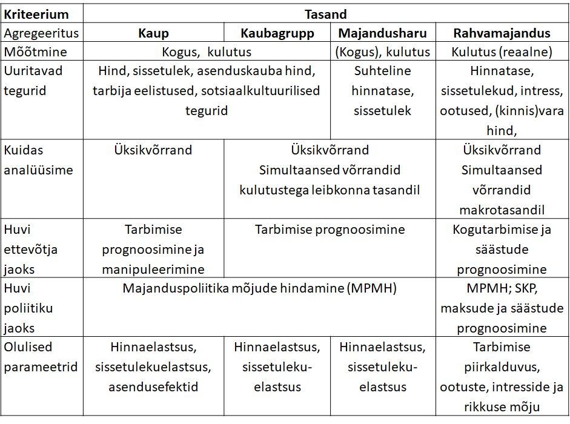
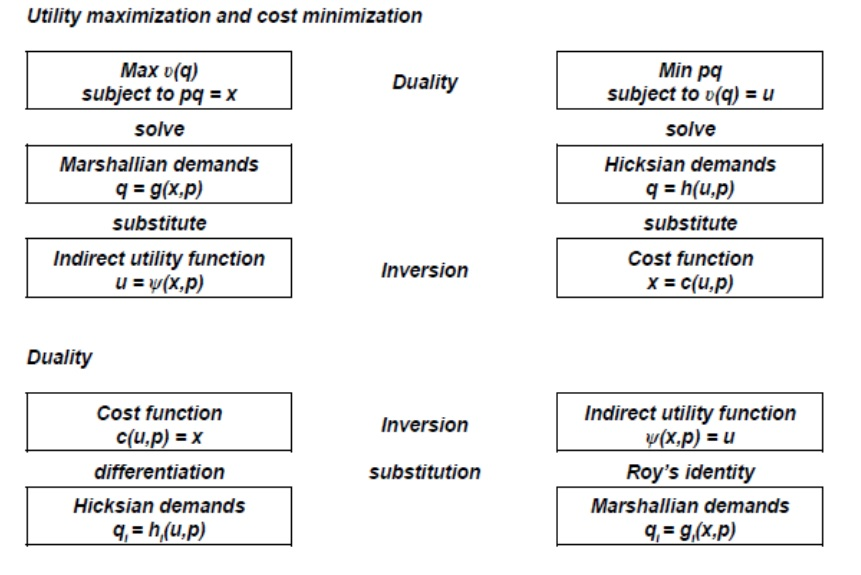
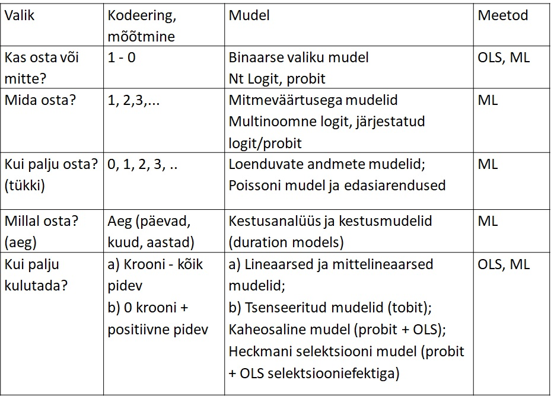

<style type="text/css">

body{ /* Normal  */
      font-size: 14px;
  }
td {  /* Table  */
  font-size: 12px;
}
h1.title {
  font-size: 24px;
  color: DarkRed;
}
h1 { /* Header 1 */
  font-size: 20px;
  color: DarkBlue;
}
h2 { /* Header 2 */
    font-size: 18px;
  color: DarkBlue;
}
h3 { /* Header 3 */
  font-size: 16px;
  font-family: "Times New Roman", Times, serif;
  color: DarkBlue;
}
code.r{ /* Code block */
    font-size: 12px;
}
pre { /* Code block - determines code spacing between lines */
    font-size: 14px;
}
</style>


```{r setup, include=FALSE}
knitr::opts_chunk$set(
	echo = TRUE,
	message = FALSE,
	warning = FALSE
)
library(tidyverse)

# setwd("C:/Users/avork/Documents/demandsystemEE")
 
```

## Sissejuhatus

Käesolev analüüs hindab tarbimise hinna- ja kogukulutuste elastused. Analüüs on tehtud projekti "Projekti C-19 majandus ehk COVID-19 seotud majandusmõjude ning nende pehmendamiseks mõeldud poliitikameetmete tõhususe hindamine" raames (https://c19majandus.ut.ee/) ning on sisendiks projekti käigus loodud simulatsioonimudelile. Analüüsis kasutatakse leibkonna-eelarve uuringu andmeid kulutuste struktuuri kohta ja tarbijahinnaindeksi komponente kaubagruppide hindade kohta. Elastsuste leidmiseks kasutatakse nõudlussüsteemi hindamisel saadud parameetreid. Analüüs annab esmalt ülevaate nõudluse modelleerimise mikroökonoomilistest alustest. Seejärel kirjeldatakse kasutatavaid andmeid,  analüüsimeetodeid ja tulemusi. Andmeanalüüsi aluseks olevad Ri koodid on kättesaadavad githubis https://github.com/AndresVork/demandsystemEE .


## Nõudluse modelleerimine


{width=500px}


### Meeldetuletus majapidamisteooriast

1.samm: tarbimiskulude suuruse määramine

  - Tarbija maksimeerib heaolu  $𝑈=𝑈(𝐿,𝐶)$
  - Arvestades ajapiirangut     $𝐿_0=𝐿+ℎ$
  - Ja eelarvepiirangut         $𝑝𝐶=𝑤ℎ+𝑅$
  - Leiame optimaalse töötunnid $ℎ=𝐹(𝑤,𝑝,𝑅)$ 
 ja tarbimiskulutused $ℎ=𝐹(𝑤,𝑝,𝑅)$

Kui tarbimise kogukulud teada, siis teise sammuna modelleerime nende jagunemist kaupade vahel. 
  - Eelarvepiirang võib olla ka mittelineaarne töötundide suhtes (nt mittelineaarse maksusüsteemi või toetuste korral): R(h), w(h)
  - Dünaamilises mudelis lisandub säästmine, millega silutakse tarbimist.


2.samm: tarbimise struktuuri määramine

  - Tarbija maksimeerib heaolu 
  $$𝑈=𝑈(𝑞_1,𝑞_2,...,𝑞_𝑘)$$
  
  - Arvestades eelarvepiirangut 
  $$𝑝_1 𝑞_1×𝑝_2 𝑞_2×...𝑝_𝑘 𝑞_𝑘=𝑦$$
  
  kus y – kogutarbimine või kogu sissetulek
      
  - Lahendame süsteemi => saame Marshalli nõudlusfunktsioonid, kus tarbitav kogus sõltub hindadest ja sissetulekust.
  
$$
\begin{aligned}
𝑞_1=𝑓_1 (𝑝_1,𝑝_2...𝑝_𝑘,𝑦)  \\
𝑞_2=𝑓_2 (𝑝_1,𝑝_2...𝑝_𝑘,𝑦)  \\ 
...                               \\
𝑞_𝑘=𝑓_𝑘 (𝑝_1,𝑝_2...𝑝_𝑘,𝑦)
\end{aligned}
$$


  - Defineerime i-nda kauba kulutuste osakaalu kogukulutustes $𝑤_𝑖=𝑝_𝑖q_𝑖/𝑦$
    
  
Võime hinnata seoseid järgmisel kujul:

$$
\begin{aligned}
\text{kogus   } & 𝑞_𝑖=𝑓_𝑖 (𝑝_1,𝑝_2...𝑝_𝑘,𝑦)+𝑢_𝑖 \\
\text{kulutus   } & 𝑝_𝑖 𝑞_𝑖=𝑓_𝑖 (𝑝_1,𝑝_2...𝑝_𝑘,𝑦)+𝑢_𝑖 \\
\text{osakaal   } &𝑤_𝑖=𝑓_𝑖 (𝑝_1,𝑝_2...𝑝_𝑘,𝑦)+𝑢_𝑖
\end{aligned}
$$


### Duaalsused majapidamisteoorias

Mikroökonoomika majapidamisteooria eelduste kohaselt on omavahel seotud kasulikkuse maksimeerimine või kulude minimeerimine, Hicksi nõudlusfunktsioonid ja Marshalli nõudlusfunktsioonid, kulufunktsioon ja kaudne kasulikkusfunktsioon. Sellest tulenevalt saab püstitada ja hinnata nõudlussüsteeme erineval kujul ning tuletada vajalikud näitajad hinnatud parameetritest.

{width=500px}

### Elastsused

Analüütikutena olema huvitatud nii nõudluse absoluutsetest muutustest hindade ja sissetuleku muutudes kui ka elastsustest:

  - Oma hinna muutuse mõju: $𝜕𝑞_𝑖/𝜕𝑝_𝑖$
  - Teise kauba hinna muutuse mõju: $𝜕𝑞_𝑖/𝜕𝑝_𝑗$
  - Sissetuleku (või kogukulutuste) muutuse  mõju: $𝜕𝑞_𝑖/𝜕𝑦$

Elastsused: 

  - Omahinnaelastus: 
  
  $$𝑒_{ii}=(𝜕𝑞_𝑖/𝑞_𝑖)/(𝜕𝑝_𝑖/𝑝_𝑖)=𝜕ln𝑞_𝑖/𝜕ln𝑝_𝑖$$
  
  - Hinna ristelastus: 
  
  $$𝑒_{ij}=(𝜕𝑞_𝑖/𝑞_𝑖)/(𝜕𝑝_j/𝑝_j)=𝜕ln𝑞_𝑖/𝜕ln𝑝_j$$
    
  - Sissetulekuelastsus (Engeli kõver) või kogukulutuste elastsus:
  
  $$𝑒_{i}=(𝜕𝑞_𝑖/𝑞_𝑖)/(𝜕y/y)=𝜕ln𝑞_𝑖/𝜕lny$$
  


### Nõudlusfunktsioonid

*Hicksi nõudlus* (ehk kompenseeritud nõudlus):

Näitab, kuidas muutub nõutav kaubakogus, kui muutub hind, teiste hindade ja kasulikkuse taseme samaks jäädes: 

$ℎ_𝑖=ℎ(𝑝_1,𝑝_2,...,𝑝_𝑘,𝑈^∗)$

Seega muutuvad kulutused.


*Marshalli nõudlus* (ehk kompenseerimata nõudlus): 

Näitab, kuidas muutub nõutav kaubakogus, kui muutub hind, teiste hindade ja kogukulutuste samaks jäädes

$𝑞_𝑖=𝑞(𝑝_1,𝑝_2,...,𝑝_𝑘,𝑦)$

Seega muutub kasulikkus


### Slutsky võrrand

$$𝜕𝑞_𝑖/𝜕𝑝_𝑗=𝜕ℎ_𝑖/𝜕𝑝_𝑗−𝜕𝑞_𝑖/𝜕𝑦×𝑞_𝑗$$
Slutsky võrrand näitab, et koguse muutus tulenevalt hinna muutusest (Marshalli nõudlus) sõltub asendusefektist ja sissetulekuefektist.

Asendusefekt näitab, mis juhtub kogusega, kui muutuvad suhtelised hinnad, aga kasulikkus jääb samaks. (Sissetuleku langus kompenseeritakse.)

Sissetulekuefekt näitab, kuidas muutub kogus, kui muutub sissetulek.

Elastsuste kujul Slutsky võrrand: 

$𝑒_{𝑖𝑗}=𝑒_{𝑖𝑗}^∗ −𝑒_𝑖×𝑤_𝑗$

Marshalli elastsus = Hicksi elastsus - sissetulekuelastsus korda osakaal tarbimiskuludes.


### Ühevõrrandilised ökonomeetrilised mudelid

Ühevõrrandilised mudelid on sobivad kitsa tootegrupi analüüsimiseks.


{width=500px}

### Pidevad ühevõrrandilised mudelid


Lineaarne mudel:
$$𝑞_i=𝛼+𝛽_1 𝑝_i+𝛽_2 𝑝_j+𝛽_3 𝐻+𝛾𝑦+ u_i$$

Logaritmkujul:

$$log(q_i)= \alpha + e_i log(y) + \sum_{j=1}^k e_{ij}log(p_j) + u_i$$


**Stone’i mudel:**

$$
\begin{aligned}
log(q_i) & = \alpha + e_i log(y/P) + \sum_{j=1}^k e_{ij}log(p_j) + u_i \\
logP & = \sum_{j=1}^k w_j log(p_j)
\end{aligned}
$$


**Working-Leser’i mudel**

Hindame kulutuste osakaalu sõltuvust sissetulekust, hindadest ja muudest leibkondade iseloomustavatest teguritest.


$$w_i= \alpha_0 + \alpha_i log(y) + \sum_{j=1}^k \beta_{ij}log(p_j) + \lambda H_i + u_i$$

Kompenseerimata omahinnaelastsus

$$ 𝑒_{ii} =−1+𝛽_{ii}/𝑤_𝑖 $$

Risthinnaelastus $$𝑒_{ij}=𝛽_{ij}/𝑤_𝑖$$

Sissetulekuelastsus $$ 𝑒_𝑖=1+𝛼_𝑖/𝑤_𝑖$$


Kui mudelis mitte sissetulek vaid kogukulud x, siis võib eraldi hinnata seose, kus kogukulud x  sõltuvad sissetulekust y.


Vt Working (1943), Leser (1963) ; vt ka Intriligator, Bodkin and Hsiao (1996) and Deaton and Muellbauer (1980).

Mikroandmete puhul võib hinnata veel ka Working-Leser’i mudel koos tsenseerimisega (Tobit mudel) või koos selektsiooniga (Heckmani mudel).


<!-- $$ -->
<!-- 𝑤_𝑖^∗=𝛼_0+𝛼_𝑖  log⁡( 𝑦)+∑_(𝑗=1)^𝑘▒〖𝛽_𝑖𝑗  log⁡( 𝑝_𝑗)〗+𝜆𝐻_𝑖+𝑢_𝑖 -->
<!-- 𝑤_𝑖^∗={■(𝑤_𝑖 "kui"  𝑤_𝑖^∗>0@0 "  kui"  𝑤_𝑖^∗≤0)┤ "ja" 𝑢_𝑖  ~⁡𝑁 (0,𝜎^2) -->
<!-- $$ -->

<!-- $$ -->
<!-- 𝑤_𝑖^∗=𝛼_0+𝛼_𝑖  log⁡( 𝑦)+∑_(𝑗=1)^𝑘▒〖𝛽_𝑖𝑗  log⁡( 𝑝_𝑗)〗+𝜆𝐻_𝑖+𝑢_𝑖𝐼_𝑖^∗=𝛼_0+𝛼_𝑖  log⁡( 𝑦)+∑_(𝑗=1)^𝑘▒〖𝛽_𝑖𝑗  log⁡( 𝑝_𝑗)〗+𝜆〖𝐻^′〗_𝑖+𝑣_𝑖𝑤_𝑖^∗={■(𝑤_𝑖 "kui"  𝐼_𝑖^∗>0@"pole jälgitav"  "  kui"  𝐼_𝑖^∗≤0)┤ "ja" (■(𝑢_𝑖@𝑣_𝑖 ))  ~⁡𝑁 𝐼𝐷((■(0@0)), (■(𝜎_1^2&𝜎_12@𝜎_12&1))) -->

<!-- $$ -->


### Tarbimisevõrrandite süsteemid

Kui tegemist on tarbija eelarve oluliste kaubagruppidega, siis peab arvestama, et leibkonnad teevad kulutused simultaanselt ja ei saa iga tootegrupi võrrandid käsitleda eraldiseisvalt.

<!-- - „Mõnevõrrandilised mudelid“, Nt kaks kauba võrrandit, mis seotud -->

Nõudlussüsteemi hidamisel on palju erinevaid lähenemisi. Nõudlussüsteemi puhul arvestatakse, et eri kulude kogusumma peab võrduma tarbimiskulude kogusummaga.

Alljärgnevalt on toodud loetelu võimalikest nõudlussüsteemidest.

- The Linear Expenditure System – eeldatud kasulikkusfunktsioon
- The Extended Linear Expenditure Model
- The Rotterdam Model  - hea testida kitsendusi
- The Quadratic Expenditure System
- The Indirect Translog Model – tuletatud kaudsest kasulikkusfunktsioonist
- AIDS - The Almost Ideal Demand System - duaalsusseostest
    - Quadratic AIDS
    - Linear AIDS
- PADS – Perhaps Adequate Demand System
- Censored Demand Systems
- Dynamic Demand Systems
- ...


Esimene, kes tuletas tarbijateooriast nõudlusvõrrandite süsteemi (ehk nõudlussüsteemi) ja hindas selle oli Stone (1954). Populaarseks hindamismudeliks kujunenud AIDSi võtsid esimesena kasutusele Deaton ja Muellbauer (1980). Nõudlussüsteeme on empiiriliselt hinnatud paljude riikide koht. 

<!-- Näiteks on hinnatud süsteemid Ungari, Poola ja Tšehhi jaoks (Banse ja Brosig, 1998). Mitmeastmelist eelarvestamist on kasutatud ja seega ka üksikute toiduainete gruppide jaoks nõudluse hinna- ja sissetulekuelastsused on leitud näiteks Tšehhi (Brosig, 1998) ja Sloveenia, Bulgaaria ning Rumeenia puhul (Mergos ja Mizzi, 1999). Elanikkonda sissetulekute järgi kolmeks grupiks jagades on leitud toiduainete nõudluselastsused USA jaoks (Huang ja Lin, 2000). -->


## Metoodika

### Almost Ideal Demand System

Deaton,A., Muellbauer,J. An Almost Ideal Demand System. American Economic Review, vol. 70, No. 3, June 1980, pp.312 – 326

(+) Rahuldab teoreetilisi kitsendusi

(-) Hinnaindeks parameetrite suhtes mittelineaarne - keeruline hinnata ning Engeli kõverad mittelineaarsed. Selle tõttu võib mõni osakaal minna negatiivseks kui sissetulek kasvab.


Hindame seosed osakaalude kujul:

$$w_i= \alpha_i + \sum_{j=1}^k \gamma_{ij}log(p_j) +  \beta_i log(Y/P) $$
Hinnaindeks on translog hinnaindeks

$$logP= \alpha_0 + \sum_{j=1}^k \alpha_{j}log(p_j) + \sum_{i=1}^k\sum_{j=1}^k \gamma_{ij}log(p_i)log(p_j)$$

Peale mudeli parameetrite hindamist saab leida elastsused:

Otsene hinnaelastsus

$$\varepsilon_{ii}=(\gamma_{ij}-\beta_i \times w_i)/𝑤_i - 1$$

Sissetulekuelastsus

$$\varepsilon_i = 1+\beta_i / w_i $$
Elastused võib leida, kas keskmiste osakaalude juures või leida kõikide vaatluste jaoks ning siis leida keskmine üle elastsuste.


### Linear Approximate Almost Ideal Demand System 

Et translog hinnaindeksit on keeruline hinnata, sest tegemist on väga mittelineaarse süsteemiga, siis kasutatakse hinnaindeksi puhul lineaarset lähendit.

LA-AIDS = AIDS koos lineaarse hinnaindeksiga

$$w_i= \alpha_i + \sum_{j=1}^k \gamma_{ij}\log(p_j) +  \beta_i \log(Y/P) $$

Stone’i hinnaindeks

$$lnP^* = \sum_{j=1}^k w_{j} \log p_j$$ 

Laspeyrese hinnaindeks

$$lnP^L = \sum_{j=1}^k \bar w_{j} \log p_j$$ 
Esineb ka teisi lähendusi hinnaindeksitele. Hinnatud parameetritest saab avaldada elastused. Esinevad erinevad lähendid (AIDS, Green + Alston, Goddard, Chalfant, Eales + Unnevehr)


_TODO:! Täpsustada elastsuste erinevad valemid_


## Andmed

Alljärgnevalt kasutame Leibkonna Eelarve Uuringu andmeid tarbimiskulutuste kohta tarbimiskvantiilide lõikes. Perioodi 1996-2007 on andmed detsiilide lõikes ning perioodi 2010-2019 aasta kohta kvintiilide lõikes.

  1) ESA tabel LE209: LEIBKONNALIIKME KULUTUSED AASTAS KULUKVINTIILI JÄRGI
https://andmed.stat.ee/et/stat/sotsiaalelu__leibkonnad__leibkonna-eelarve__aasta-kulutused/LE209

  2) LE113: LEIBKONNALIIKME KULUTUSED KUUS LEIBKONNA KULUDETSIILI JÄRGI (1996-2007) https://andmed.stat.ee/et/stat/Lepetatud_tabelid__Sotsiaalelu.%20Arhiiv__Leibkonnad.%20%20Arhiiv__kuu-kulutused/LE113

Hinnad on võetud Eurostatist HICP andmetest. 

https://appsso.eurostat.ec.europa.eu/nui/show.do?dataset=prc_hicp_aind&lang=en


Lähteandmed on antud järgmistes gruppides (COICOP esimesel tasemel)


LEU 1996-2007 | LEU 2010-2019 | Prices|
|-------------|-------------|--------------|
|Expenditure total | Expenditure total | |
|Consumption expenditure | Consumption expenditure | CP00 - All-items HICP|
|Food and non-alcoholic beverages | Food and non-alcoholic beverages | CP01 - Food and non-alcoholic beverages|
|Alcoholic beverages | Alcoholic beverages and tobacco | CP02 - Alcoholic beverages, tobacco and narcotics|
|Tobacco |  | |
|Clothing and footwear | Clothing and footwear | CP03 - Clothing and footwear|
|Housing | Housing | CP04 - Housing, water, electricity, gas and other fuels|
|Household equipment and operation | Household equipment and operation | CP05 - Furnishings, household equipment and routine household maintenance|
|Health | Health | CP06 - Health|
|Transport | Transport | CP07 - Transport|
|Communication services | Communication | CP08 - Communications|
|Recreation, leisure and entertainment | Recreation and culture | CP09 - Recreation and culture|
|Education | Education | CP10 - Education|
|Hotels, cafés, restaurants | Restaurants and hotels | CP11 - Restaurants and hotels|
|Miscellaneous goods and services | Miscellaneous goods and services | CP12 - Miscellaneous goods and services|
|Non-monetary consumption |  | |
|Other expenditure | Other expenditure |  |


Varasemate LEU andmete puhul agregeeritakse alkoholi ja tubakatoodete tarbimine ühtsesse gruppi ning jäetakse välja mitterahalised kulud. 

Puuduvad andmed kvintiilide mõnede kulutuste kategooriate kohta (nt haridus aastatel 2005-2007) on leitud kasutades olemasolevate andmete keskmist väärtust vastavalt eraldi vana ja uue LEU andmete kohta.

Kokku tarbimiskulude leibkonnakvantiilide lõikes on toodud järgmisel joonisel.


```{r}

load(file = "../Andmed/hbsexppriceslevel1.RData")
#load(file = "Andmed/hbsexppriceslevel1.RData")

ggplot(hbsexppriceslevel1 %>% group_by(year, quantile) %>% slice(1), aes(x=year, y = consexp, color = as.factor(quantile))) +
  geom_line() +
  geom_point() +
  labs(color = "Quantile", x ="", y = "Annual expenditure per household member, EUR") +
  theme_bw()+
  theme(axis.text.x = element_text(angle = 90, vjust = 0.5, hjust=1))


```


Osakaalude andmed on toodud järgmisel joonisel. Aastate 1995-2007 kohta on antud andmed detsiilide kohta ning aastate 2010-2019 kohta on kvintiilide kohta.


```{r}

#Shares
ggplot(hbsexppriceslevel1, aes(x=year, y = share, color = as.factor(quantile))) +
  geom_line() +
  geom_point() +
  facet_wrap(~coicop, scales = "free_y") + 
  labs(color = "Quantile", x ="", y = "Share") +
  theme_bw()+
  theme(axis.text.x = element_text(angle = 90, vjust = 0.5, hjust=1))


```

Hinnaindeksite dünaamika on esitatud järgmisel joonisel


```{r}

load(file = "../Andmed/hicp_en.RData")
#load(file = "Andmed/hicp_en.RData")
commodities <- unique(hbsexppriceslevel1$coicop)

temp <- hicp_en %>% filter(geo =="EE", unit == "INX_A_AVG", coicop %in% c(commodities, "CP00"))

ggplot(temp, aes(x=time, y = values, color = coicop)) +
  geom_line() +
  geom_point() +
  labs(color = "Commodity group", x ="", y = "Price index") +
  theme_bw()+
  theme(axis.text.x = element_text(angle = 90, vjust = 0.5, hjust=1))

```


## Mudel


Kasutame Ri paketis `micEconAids` toodud funktsioone `aidsEst` AIDS mudeli hindamiseks ja `elas` hinna ja kogukulutuste elastuse hindamiseks. 

vt https://cran.r-project.org/web/packages/micEconAids/vignettes/micEconAids_vignette.pdf

Tulemused kasutades Stone'i hinnaindeksit on järgmised.

```{r}
library("micEconAids")

#First put price and share into single variable
df <- hbsexppriceslevel1 %>% gather(key = "xvar", value  = "value", -year, -quantile, -coicop, -consexp)
#Merge values to get new variable names
df <- df %>% mutate(x = paste0(coicop, xvar))
#Shape back to wide
dfw <- df %>% select(year, quantile, consexp, x, value) %>% spread(key = "x", value = "value") %>% 
  as.data.frame()

priceNames <- setdiff(colnames(dfw)[grepl("price", colnames(dfw))], "CP00price")
shareNames <- setdiff(colnames(dfw)[grepl("share", colnames(dfw))], "CP00share")

laaidsResult <- aidsEst( priceNames, shareNames, "consexp", data = dfw,  priceIndex = "S" )

print(laaidsResult)

```


Kulutuste elastsuste punkthinnangud koos ligilähedase 95% usaldusintervalliga

```{r}
pMeans <- colMeans( dfw[ , priceNames ] )
wMeans <- colMeans( dfw[ , shareNames ] )
xtMean <- mean( dfw[ , "consexp" ] )

aidsResultElasCov <- aidsElas( coef( laaidsResult), prices = pMeans, totExp = xtMean, coefCov = vcov( laaidsResult), df = df.residual( laaidsResult), priceIndex = "S")

temp <- aidsResultElasCov
punkthinnang <- temp$exp
standardvead <- temp$expStEr

tempdf <- as.data.frame(cbind(punkthinnang,standardvead))
coicopnimed <- c("Toit ja alkoholita joogid", "Alkohol ja tubakas", "Rõivad, jalatsid", "Eluase", 
"Majapidamiskulud", "Tervishoid", "Transport", "Side", "Vaba aeg", "Haridus", "Restoranid, hotellid", "Muud")
tempdf$coicop <- factor(coicopnimed, levels = coicopnimed)

ggplot(tempdf) +
  geom_errorbar(aes(x=coicop, ymin=punkthinnang-2*standardvead, 
                    ymax = punkthinnang + 2*standardvead), width=0.2, size=1, color="blue") + 
geom_point(data=tempdf, mapping=aes(x=coicop, y=punkthinnang), size=4, shape=15, fill="white") +
labs(title="Kogukulutuste elastsus", y = "elastsus", x="")  +
  coord_flip() +
  geom_hline(yintercept=1)+
    theme_bw()

```


Marshalli omahinnaelastsused koos ligilähedaste 95% usaldusintervallidega


```{r}

punkthinnang <-diag(temp$marshall)
standardvead <- diag(temp$marshallStEr)

tempdf <- data.frame(cbind(punkthinnang, standardvead))
tempdf$coicop <- factor(coicopnimed, levels = coicopnimed)

ggplot(tempdf) +
  geom_errorbar(aes(x=coicop, ymin=punkthinnang-2*standardvead, ymax = punkthinnang + 2*standardvead), width=0.2, size=1, color="blue") + 
geom_point(data=tempdf, mapping=aes(x=coicop, y=punkthinnang), size=4, shape=15, fill="white") +
labs(title="Marshalli hinnaelastsused", y = "elastsus", x = "")  +
    coord_flip() +
    geom_hline(yintercept=0)+
  theme_bw()

```


Hicksi omahinnaelastsused koos ligilähedaste 95% usaldusintervallidega.

```{r}

punkthinnang <-diag(temp$hicks)
standardvead <- diag(temp$hicksStEr)

tempdf <- data.frame(cbind(punkthinnang, standardvead))
tempdf$coicop <- factor(coicopnimed, levels = coicopnimed)

ggplot(tempdf) +
  geom_errorbar(aes(x=coicop, ymin=punkthinnang-2*standardvead, ymax = punkthinnang + 2*standardvead), width=0.2, size=1, color="blue") + 
geom_point(data=tempdf, mapping=aes(x=coicop, y=punkthinnang), size=4, shape=15, fill="white") +
labs(title="Hicksi hinnaelastsused", y = "elastsus", x = "")  +
    coord_flip() +
    geom_hline(yintercept=0)+
  theme_bw()

```


Nagu näha, siis hinnaelastsused on väga ebatäpselt hinnatud.

### Teha

- testida erinevate hindamismeetodite ja elaststuste lähendite mõju
- testida deterministliku trendi kasutamise mõju (e.g. eelistuste muutus üle aastate) ja /või andmete metoodika muutumise mõju (indikaator uue ja vana LEU eristamiseks)
- kaaluda paremaid imputeerimismeetodeid


## Lisa

Parameetritele vastavad kõik elastsused on järgmised

```{r}
elas(laaidsResult)

```

